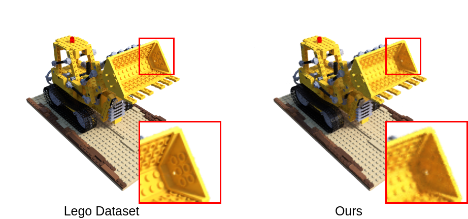

# Neural Radiance Field (NeRF)
Repository for Computer Vision (RBE549) Project 2 Phase 2: Buildings built in minutes - NeRF (Neural Radiance Fields)

### Steps to run the code:

To run Wrapper.py, use the following command:
```bash
python Wrapper.py --data_path <path_to_data_directory> --log_dir <path_to_log_directory>

usage: Wrapper.py [-h] [--data_path DATA_PATH] [--mode MODE] [--log_dir LOG_DIR] [--ckpt_path CKPT_PATH] [--num_epochs NUM_EPOCHS]
                  [--lr LR] [--gamma GAMMA] [--n_pos_freq N_POS_FREQ] [--n_dirc_freq N_DIRC_FREQ] [--batch_size BATCH_SIZE]
                  [--tn TN] [--tf TF] [--n_samples N_SAMPLES] [--log_every LOG_EVERY] [--save_every SAVE_EVERY] [--test_every TEST_EVERY] [-v]

options:
  -h, --help                    show this help message and exit
  --data_path DATA_PATH         dataset path
  --mode MODE                   train/test/test_single_image/val
  --log_dir LOG_DIR             Logs Directory
  --ckpt_path CKPT_PATH         Checkpoint path to test model
  --num_epochs NUM_EPOCHS       number of epochs for training
  --lr LR                       training learning rate
  --gamma GAMMA                 decay rate for learning rate scheduler
  --n_pos_freq N_POS_FREQ       number of positional encoding frequencies for position
  --n_dirc_freq N_DIRC_FREQ     number of positional encoding frequencies for viewing direction
  --batch_size BATCH_SIZE       number of rays per batch
  --tn TN                       tn Plane Distance
  --tf TF                       tf Plane Distance
  --n_samples N_SAMPLES         number of samples per ray
  --log_every LOG_EVERY         Log the results every <> iterations
  --save_every SAVE_EVERY       Save model every <> iterations
  --test_every TEST_EVERY       Test model every <> iterations
  -v, --verbose                 Verbose Execution
```

Download the desired dataset from the NeRF official datasets ([link](https://drive.google.com/drive/folders/128yBriW1IG_3NJ5Rp7APSTZsJqdJdfc1?usp=sharing)). Our data loader is designed for the Blender generated datasets (nerf_synthetic).

Example to run the training on the Lego dataset, in a verbose manner:
```bash
python Wrapper.py --log_dir trial_logs --data_path Data/lego/ -v
```

The code automatically creates the `Logs` folder and saves the logs of the current training run in the `log_dir` subfolder. It contains a `model` subfolder which has the best model weights and the model weights at every `save_every` epoch. It also contains a `plots` subfolder with the plots for the training loss and PSNR, plotted versus number of iterations. There is also a `media` subfolder which saves the generated test image at every `test_every` epoch. Finally, the text file `logs.txt` saves the training hyperparameters and logs for each epoch.


### Training Loss Over Time
For Lego Dataset:
<p align="left">
  
</p>


## Test Image Evolution
<p align="left">
  
</p>

### Outputs Comparison:
<p align="left">
  
</p>

<p align="left">
  
</p>


## Outputs:


